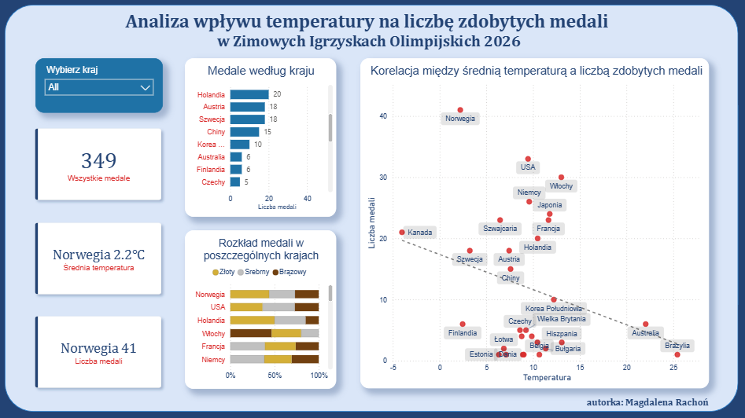

# Analiza wpływu temperatury na liczbę zdobytych medali w Zimowych Igrzyskach Olimpijskich 2026

## Spis treści
* [O projekcie](#o-projekcie)
* [Źródła danych](#źródła-danych)
* [Narzędzia](#narzędzia)
* [Czyszczenie i przygotowywanie danych](#czyszczenie-i-przygotowywanie-danych)
* [Wykorzystane miary DAX](#wykorzystane-miary-dax)
* [Modelowanie danych](#modelowanie-danych)
* [Wyniki i wnioski](#wyniki-i-wnioski)
* [Ograniczenia](#ograniczenia)

## O projekcie
Celem projektu było zbadanie korelacji między średnią roczną temperaturą w danym kraju, a liczbą zdobytych medali podczas Zimowych Igrzysk Olimpijskich 2026. Projekt ma formę interaktywnego dashboardu, który pozwala wizualnie ocenić, czy „zimniejsze” kraje rzeczywiście dominują w sportach zimowych.



## Źródła danych
W analizie wykorzystano dwa główne źródła:
* **Wikipedia**: [Lista krajów według średniej rocznej temperatury](https://en.wikipedia.org/wiki/List_of_countries_by_average_yearly_temperature)
* **TVP Sport**: [Klasyfikacja medalowa ­– Mediolan-Cortina 2026](https://sport.tvp.pl/mediolan-cortina-2026/klasyfikacja-medalowa)

## Narzędzia
* **Microsoft Excel**: Wstępne przeglądanie danych.
* **Power Query**: Pobieranie, transformacja i czyszczenie danych.
* **Power BI**: Modelowanie danych oraz stworzenie interaktywnego dashboardu.

## Czyszczenie i przygotowywanie danych
Proces ETL został wykonany w Power Query i obejmował:
1. **Filtrację**: usunięto kraje z wartością „0” medali.
2. **Transformację temperatury**:
* Usunięcie jednostek „°C” i przekształcenie kolumny na typ liczbowy.
* Naprawa błędnego znaku „-”, który był odczytywany jako tekst.
* Zastosowanie **ustawień regionalnych (angielski)**, aby poprawnie zaimportować liczby dziesiętne z kropką.
3. **Normalizację**: Wybór tylko niezbędnych kolumn do analizy.
4. **Wzbogacenie danych (AI)**: Wykorzystano sztuczną inteligencję (LLM) do automatycznego przetłumaczenia nazw krajów z języka angielskiego na polski, co pozwoliło na szybkie stworzenie kolumny mapującej w tabeli słownikowej.

## Wykorzystane miary DAX
* **Suma medali**:

```Wszystkie medale = SUM(fact_medale[Razem])```

* **Średnia temperatura**:

```Średnia temperatura KPI =
VAR Country =
    COALESCE(SELECTEDVALUE(dim_kraje[Kraj]), "Norwegia")
VAR Temperatura =
    CALCULATE(
        AVERAGE(fact_temperatura[Temperatura]),
        dim_kraje[Kraj] = Country)
RETRUN
    IF(
        Country = "AIN (Neutralni)",
        Country & " – ",
        Country & "  " & FORMAT(Temperatura, "0.0") & "°C")```

* **Liczba medali**:

```Liczba medali KPI = 
VAR Country = 
    COALESCE(SELECTEDVALUE(dim_kraje[Kraj]), "Norwegia")
VAR Medals =
    CALCULATE(
        [Wszystkie medale], 
        dim_kraje[Kraj] = Country)
RETURN
    Country & "  " & Medals```

## Modelowanie danych
Model danych oparto na strukturze **gwiazdy (star schema)**:
* **Tabela wymiarów (`dim_kraj`)**: Pełni rolę słownika ujednolicającego nazwy krajów (PL z TVP Sport oraz EN z Wikipedii).
* **Tabele faktów**: `fact_medale` oraz `fact_temperatura`.
* **Relacje**: Jeden-do-wielu (1:*) z jednokierunkowym filtrowaniem od tabeli wymiarów do tabeli faktów.

>[!Notatka]
> W słowniku uwzględniono grupę **”AIN”**(neutralni sportowcy), ponieważ zdobyli oni medal, ale jako, że nie reprezentują oni konkretnego terytorium, przypisano im znak `–` w kontekście temperatury.

## Wyniki i wnioski
* **Liderzy**: Norwegia, niemająca najniższej temperatury (2.2°C), pozostaje liderem klasyfikacji z największą liczbą medali.
* **Dominacja Norwegii**: Norwegia dominuje nad sąsiadami (Finlandia, Szwecja) o zbliżonym klimacie. Kraje te osiągają znacznie mniej medali. To sugeruje, że za sukcesem może stać system szkolenia lub dostępna infrastruktura sportowa.
* **Najniższa temperatura**: Kanada jako najzimniejszy kraj nie zdobywa najwięcej medali. Zimno nie gwarantuje sukcesu. W tym przypadku ważniejsza może być populacja.
* **Wyjątkowa korelacja**: Włochy, w których odbyły się igrzyska olimpijskie oraz Australia, mimo wyższej średniej temperatury, zdobywają więcej medali, niż niektóre zimniejsze kraje (np. Estonia, Łotwa).
* **Temperatura to nie najważniejszy czynnik**: Porównanie zimnej Finlandii (2,46°C) i ciepłej Australii (22,05°C), oba kraje zdobywają po 6 medali, mimo różnicy (19,59°C) w średniej rocznej temperaturze.
* **Interaktywność**: Dashboard pozwala na filtrowanie danych według konkretnego kraju, co automatycznie aktualizuje kluczowe wskaźniki (KPI).

## Ograniczenia
* **Brak danych historycznych**: Analiza opiera się na bieżącej klasyfikacji medalowej (2026).
* **Czynniki ekonomiczne**: Analiza nie uwzględnia PKB ani ilości infrastruktury sportowej, które z pewnością mają wpływ na wyniki olimpijskie.

## Autorka
* Magdalena Rachoń – [GitHub](github.com/mag-rac)
